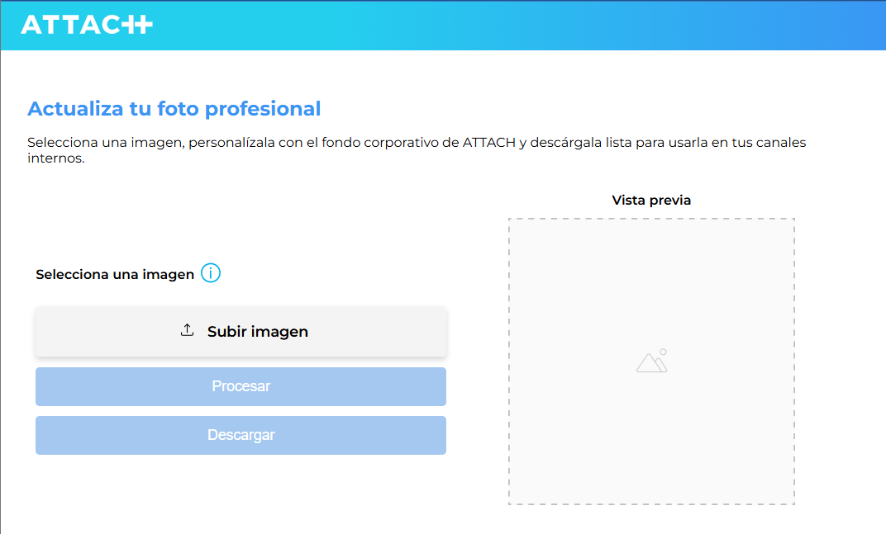
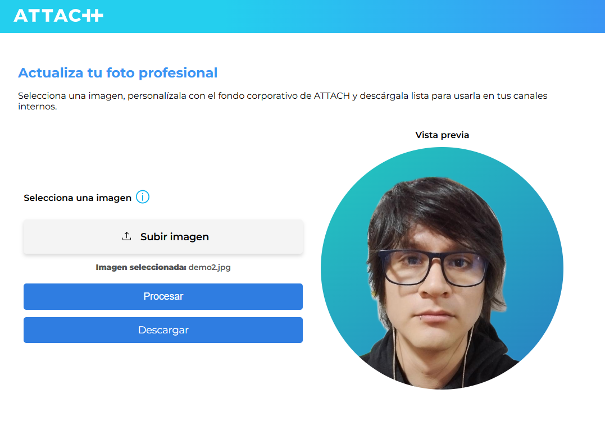

# Remove Background

¡Bienvenido/a!  
Esta aplicación te permite **eliminar el fondo de tus fotos** y personalizarlas en solo unos clics.

## ✨ ¿Qué puedes hacer aquí?

- Subir una foto desde tu computadora.
- Procesarla para eliminar el fondo automáticamente.
- Aplicar el fondo en la configuración de color
- Descargar la imagen lista para usar en tus canales internos.

## 🚀 ¿Cómo usar la aplicación?

1. **Abre la aplicación** en tu navegador.
2. Haz clic en **"Subir imagen"** y selecciona una foto desde tu dispositivo.
3. Haz clic en **"Procesar"** para eliminar el fondo y aplicar el fondo corporativo.
4. Cuando el proceso termine, haz clic en **"Descargar"** para guardar tu nueva imagen.

> **Recomendaciones:**  
> - Usa fotos en formato PNG o JPG.  
> - El tamaño máximo recomendado es 5 MB.  
> - Para mejores resultados, usa fotos tomadas de los hombros hacia arriba, con buena iluminación y mirando de frente a la cámara.

## 🖼️ Vista previa

## ❓ Preguntas frecuentes

- **¿Mis fotos se almacenan en algún lugar?**  
  No, tus imágenes solo se procesan temporalmente para generar el resultado y no se almacensan en el servidor.

- **¿Puedo usar la aplicación en el móvil?**  
  Sí, la aplicación es compatible con dispositivos móviles y de escritorio.

## 🛠️ ¿Quieres saber cómo funciona el código?

Consulta la [Wiki del repositorio](https://github.com/tuusuario/tu-repo/wiki) para ver detalles técnicos, estructura del proyecto y cómo contribuir.

## 📬 Contacto

¿Tienes dudas, sugerencias o encontraste un error?  
Escríbeme [cfac289610@gmail.com](mailto:cfac289610@gmail.com) o abre un issue en este repositorio.

---

¡Gracias!  
